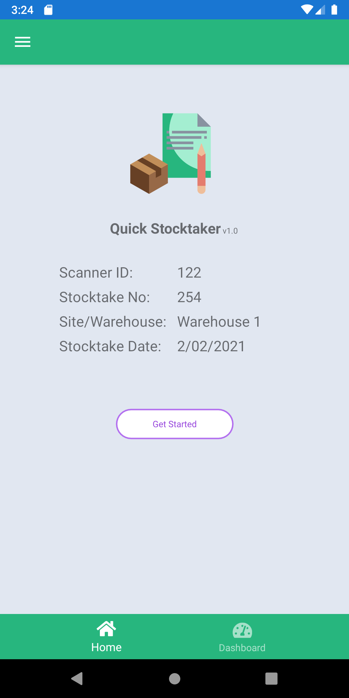
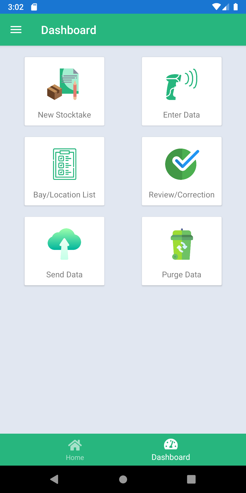
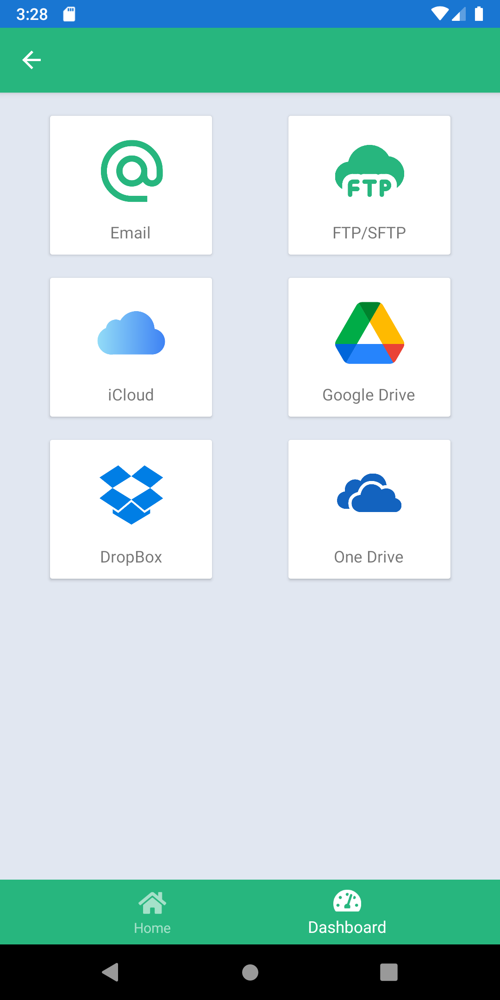
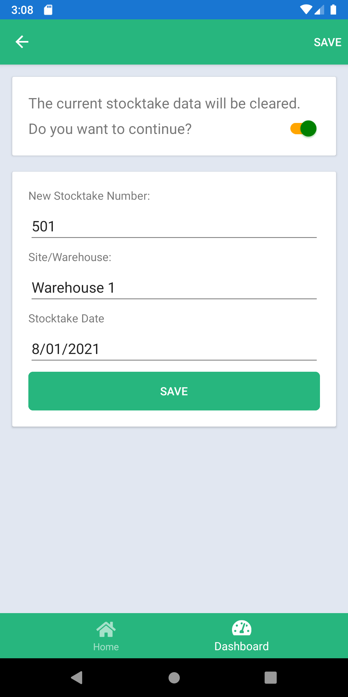
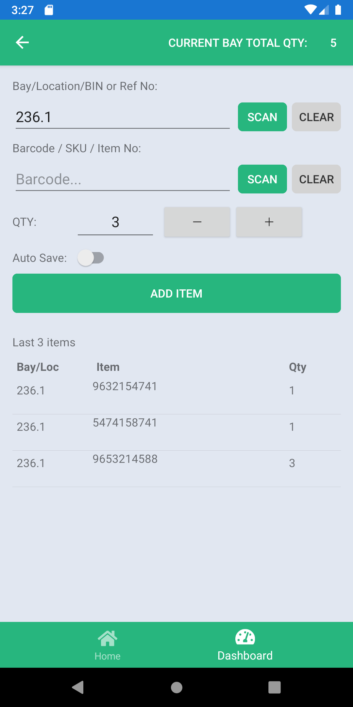
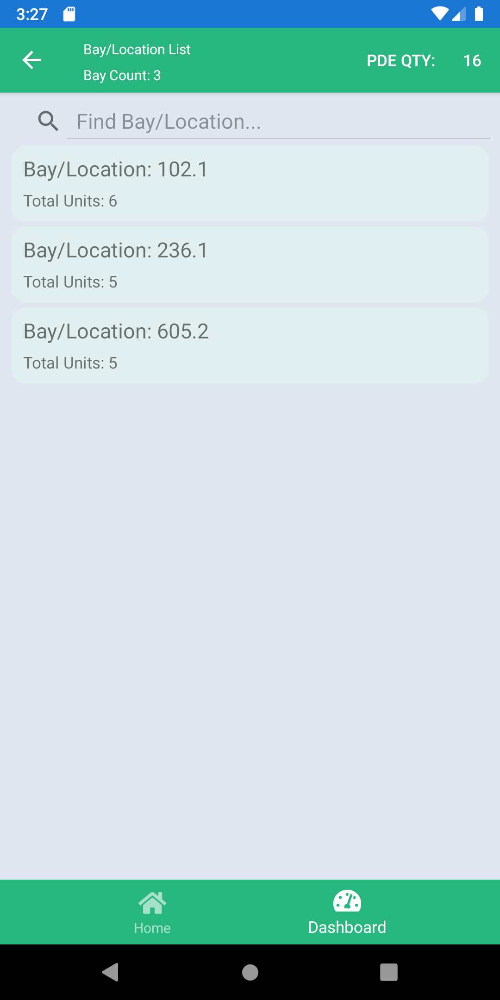
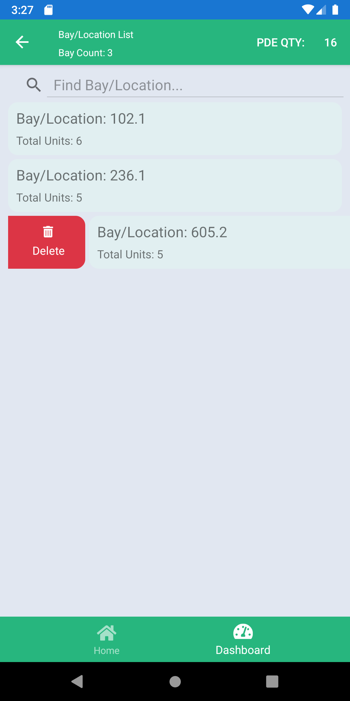
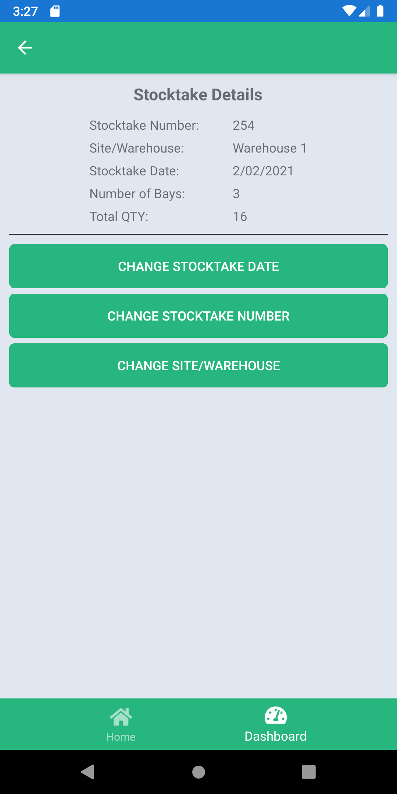
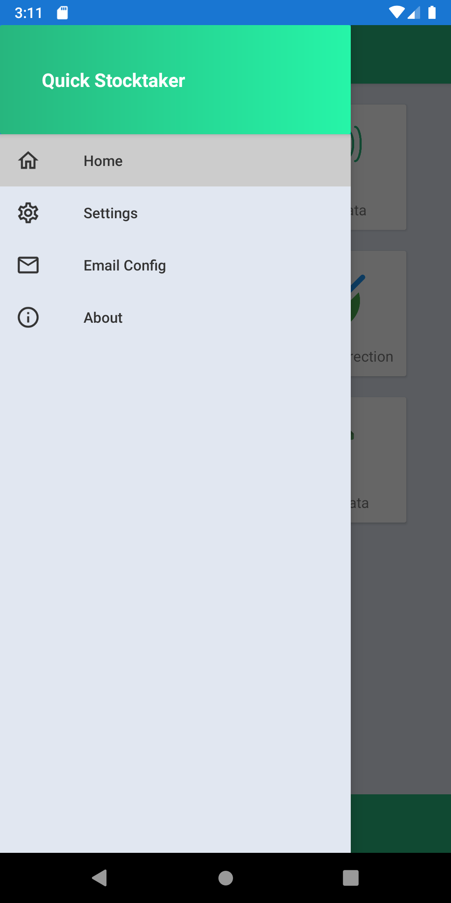
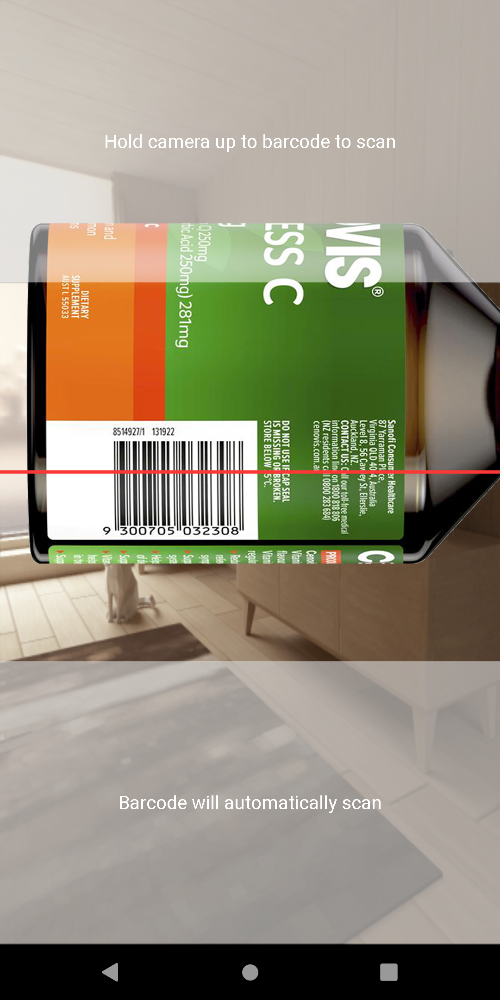

# Quick Stocktaker

# Update!!!
### Migrated to .NET 8 and MAUI. For the old Xamarin Form version, please check out the xamarin-from branch.

## Overview
Quick Stocktaker/Stock Counter is a FREE Stock / Inventory counting & checking app for Android mobile devices.

This app helps you to keep track of your stock. It makes the stocktake job much easier with your phone. No other expensive equipment is needed.

It can be used as a stock management tool or inventory tracker in a store or in a warehouse. 

Key features:
- Scan the barcode on your product using any device camera
- Export to CSV file thus you can use it in your ERP/CRM;
- Send the physical inventory counting result to your email easily
- No Internet is required: All your Stock Count / Stock Take data stored locally on your device

DISCLAIMER:
By installing and using Stock Count(Stock Take) you agree that the author is not responsible for any financial losses that could occur or not comply with government regulation.

## Screen Shots

  

# Support
If you've got value from any of the content which I have created, then I would also very much appreciate your support by buying me a beer.

